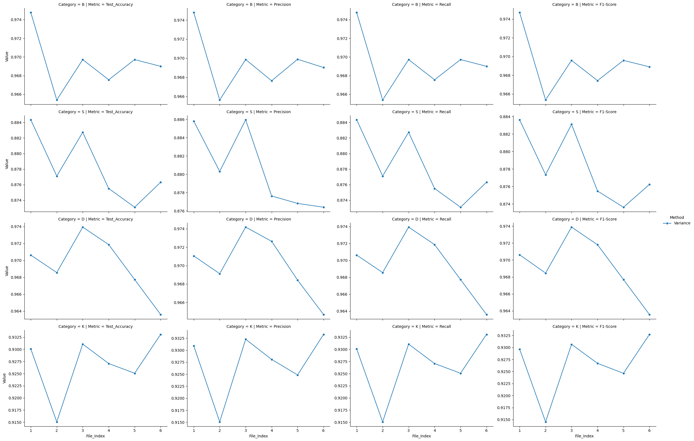

# A Deep Learning Approach to Anti-Cathepsin Activity Prediction in Drug Discovery using Molecular Descriptors and Feature Elimination

## Research Overview
This research focuses on predicting the interactions of ligands with cathepsins B, S, D, and K using machine learning techniques. The datasets from BindingDB and ChEMBL were utilized, with IC50 values classified into four categories: potent, active, intermediate, and inactive. Ligands in SMILES format were converted to 217 descriptors, which were used as input to a 1D Convolutional Neural Network (CNN) for classification. The research also addressed challenges like large input sizes and data imbalance using SMOTE and feature elimination techniques.

## Table of Contents
1. [Introduction](#introduction)
2. [Dataset](#dataset)
3. [Data Preprocessing](#data-preprocessing)
4. [Model Training](#model-training)
5. [Feature Selection](#feature-selection)
6. [Results](#results)
7. [Future Work](#future-work)
8. [Dependencies](#dependencies)

## Introduction
Cathepsins are a family of proteases involved in various physiological processes. In this research, we focus on predicting how ligands interact with cathepsins B, S, D, and K, which are crucial for drug development. The goal was to classify ligands based on their IC50 values, which represent the potency of a ligand in inhibiting a particular enzyme.

## Dataset
The dataset used in this research was sourced from:
- **BindingDB**: A public repository of measured binding affinities, including IC50 values for protein-ligand interactions.
- **ChEMBL**: A database of bioactive drug-like molecules with annotated biological activity.

The dataset includes:
- Ligands that act as drugs interacting with cathepsins.
- IC50 values indicating ligand potency.

### Data Cleaning
- Retained only data for human species.
- Removed rows with NaN IC50 values.
- Reatined only relevant columns.

## Data Preprocessing
### IC50 Classification
IC50 values were categorized into three classes:
- **Potent**: Low IC50 values (indicating high potency).
- **Active**: Active IC50 values.
- **Intermediate**: Moderate IC50 values.
- **Inactive**: High IC50 values (indicating low potency).

### Descriptor Calculation
Ligands in SMILES format were converted to 217 descriptors using a descriptor calculation tool (RDKit).

### Data Augmentation (SMOTE)
To address the class imbalance in the dataset, SMOTE (Synthetic Minority Over-sampling Technique) was used to augment the minority class.

## Model Training
### Model Architecture
- A **1D Convolutional Neural Network (CNN)** was used to predict the outcomes based on the descriptors.
- The model was trained on the complete dataset.

### Challenges
- **Large input sizes**: The input vector was too large, which posed a challenge for training.
- **Data imbalance**: The dataset was highly skewed, which was addressed by using SMOTE for balancing the classes.

## Feature Selection
Various feature elimination methods were applied to reduce the dimensionality of the dataset:
1. **RFE (Recursive Feature Elimination)**: Reduced the dataset to ~40 descriptors while maintaining performance.
2. **Variance Thresholding**: Removed features with low variance.
3. **Correlation-based Feature Selection**: Removed highly correlated features.

### **1. Topological Descriptors** 
- **Ipc (Information Content Index, Order 2) [58]**  
  A topological descriptor that quantifies molecular complexity by analyzing atom connectivity and structural diversity.

- **HeavyAtomCount [48]**   
  The number of non-hydrogen atoms in a molecule, often correlated with molecular size.

- **MolMR (Molecular Refractivity) [48]**  
  A measure of a molecule’s polarizability, which is related to volume and electron cloud distribution.

- **LabuteASA (Labute's Approximate Surface Area) [47]**  
  Estimates the molecular surface area, often used in QSAR (Quantitative Structure-Activity Relationship) studies.

---

### **2. Electronic Descriptors (EState)**
These are **electronic state (EState) indices**, which describe the electronic environment of atoms in a molecule.

- **MaxAbsEStateIndex [48]**  
  The highest absolute value of the EState index in a molecule, indicating regions of high electron density.

- **EState_VSA1 [52], EState_VSA4 [47], EState_VSA5 [51], EState_VSA6 [51], EState_VSA10 [48]**  
  These are EState-based van der Waals surface area (VSA) descriptors, which partition molecular surface area based on the EState indices. Different numbers correspond to different EState index ranges.

- **VSA_EState2 [50]**  
  Combines van der Waals surface area with EState indices to reflect the electronic environment.

---

### **3. Hydrophobicity Descriptors (SlogP_VSA & SMR_VSA)**
These descriptors relate molecular surface area with hydrophobic (logP) or molar refractivity (MR) values.

- **SlogP_VSA2 [51], SlogP_VSA3 [47], SlogP_VSA5 [47]**  
  Surface areas of molecular regions binned by their hydrophobicity (SlogP), which describes a molecule’s lipophilicity.

- **SMR_VSA1 [52], SMR_VSA4 [47], SMR_VSA10 [49]**  
  Surface areas of molecular regions binned by molar refractivity (SMR), which indicates steric and electronic effects.

---

### **4. Partial Charge-Related Descriptors (PEOE_VSA)**
These descriptors use **PEOE (Partial Equalization of Orbital Electronegativities)** to estimate charge distributions in a molecule.

- **PEOE_VSA6 [49], PEOE_VSA10 [47]**  
  Van der Waals surface area contributions from molecular regions with specific partial charge values.

---

### **5. Polar Surface Area (TPSA)**
- **TPSA (Topological Polar Surface Area) [52]**  
  The total surface area of polar atoms (oxygen, nitrogen, hydrogen-bond donors/acceptors), useful for estimating drug absorption and permeability.

---

### **Summary**
- **Topological Descriptors** → Molecular size & connectivity  
- **Electronic Descriptors (EState)** → Electron distribution  
- **Hydrophobicity Descriptors (SlogP_VSA, SMR_VSA)** → Lipophilicity and steric effects  
- **Charge-Related Descriptors (PEOE_VSA)** → Partial charge distribution  
- **TPSA** → Polar surface area, drug permeability  

## Future Work 
- Usage of Graph Neural Network along with Graph representation of Ligands.

## Results
### Correlation Based Accuracy

- File 1: 168 features [22% decrease in size]  0.9
- File 2: 81  features  [62% decrease in size] 0.5
- File 3: 45 features [79% decrease in size] 0.3

### Variance Based Accuracy

- File 1: 186 features [14.2% decrease in size]  0.01
- File 2: 141  features  [35.2% decrease in size] 0.1
- File 3: 114 features [47.5% decrease in size] 0.5
- File 4: 113 features [47.9% decrease in size]  0.6
- File 5: 112  features  [48.3% decrease in size] 0.7
- File 6: 108 features [50.2% decrease in size] 0.8

### RFE Based Accuracy

- File 1: 130 features [40.2% decrease in size]  
- File 2: 90  features  [58.5.2% decrease in size] 
- File 3: 50 features [76.9% decrease in size] 
- File 4: 40 features [81.5% decrease in size]  
- File 5: 30  features  [86.1% decrease in size]
- File 6: 20 features [90.7% decrease in size] 

## Overall Table for reference
### For the CNN row, the accuracy results for each category are as follows:
- **Cathepsin B**: 97.692%
- **Cathepsin S**: 87.951%
- **Cathepsin D**: 96.524%
- **Cathepsin K**: 93.006%

| Method      | Category | File_Index | Test_Accuracy   | Precision       | Recall          | F1-Score        |
|-------------|----------|------------|-----------------|-----------------|-----------------|-----------------|
|Correlation|B|1|**0.9711607694625854**|0.9716005329222748|0.9711607786589762|0.9710346055145948|
|Correlation|B|2|0.9639509916305542|0.9639145787220054|0.9639509733237203|0.9638712477978894|
|Correlation|B|3|0.898341715335846|0.8995738880851906|0.8983417447728911|0.898210478637559|
|Variance|B|1|0.9747656583786011|0.9747845598431052|0.9747656813266041|0.9747019607239696|
|Variance|B|2|0.9653929471969604|0.9656309269297354|0.9653929343907715|0.9653562026192504|
|Variance|B|3|0.9697188138961792|0.9698637106531169|0.969718817591925|0.9695882737446|
|Variance|B|4|0.9675558805465698|0.967637168017168|0.9675558759913482|0.9674227212673389|
|Variance|B|5|0.9697188138961792|0.9698901452123195|0.969718817591925|0.9695839405894983|
|Variance|B|6|0.9689978361129761|0.9690234164159547|0.9689978370583994|0.9688941900511631|
|RFE|B|1|0.9675558805465698|0.9674878164566835|0.9675558759913482|0.9674363456862948|
|RFE|B|2|0.968276858329773|0.9683181649994399|0.9682768565248738|0.9681627437818263|
|RFE|B|3|0.9697188138961792|0.9697566954344019|0.969718817591925|0.969639303763679|
|RFE|B|4|0.9603460431098938|0.9608454677423558|0.9603460706560922|0.9601954995898154|
|RFE|B|5|0.9545782208442688|0.9547642246999012|0.9545782263878875|0.954519148120443|
|RFE|B|6|0.9401586055755615|0.9411819981182311|0.9401586157173756|0.9399926813903084|
||||||||

| Method      | Category | File_Index | Test_Accuracy   | Precision       | Recall          | F1-Score        |
|-------------|----------|------------|-----------------|-----------------|-----------------|-----------------|
|Correlation|S|1|0.8843373656272888|0.8865815258479512|0.8843373493975903|0.8843265473405466|
|Correlation|S|2|0.8481927514076233|0.8464858924275791|0.8481927710843373|0.8465961039355744|
|Correlation|S|3|0.6401606202125549|0.6297851502540344|0.6401606425702812|0.631388216165559|
|Variance|S|1|**0.8843373656272888**|0.8858064722146842|0.8843373493975903|0.8836330265636338|
|Variance|S|2|0.8771084547042847|0.88031839284855|0.8771084337349397|0.8773618217072549|
|Variance|S|3|0.8827309012413025|0.8859535270023704|0.8827309236947791|0.8831116100714843|
|Variance|S|4|0.8755019903182983|0.877627273832879|0.8755020080321285|0.8754869588347589|
|Variance|S|5|0.8730923533439636|0.8768128989032187|0.8730923694779117|0.8736281826941967|
|Variance|S|6|0.8763052225112915|0.8763964291042305|0.8763052208835341|0.8762319942714872|
|RFE|S|1|0.8698795437812805|0.8736365844436154|0.8698795180722891|0.8698018730614725|
|RFE|S|2|0.8763052225112915|0.8776304090168205|0.8763052208835341|0.8764233253194592|
|RFE|S|3|0.8706827163696289|0.8745255788211829|0.8706827309236947|0.8713249731534637|
|RFE|S|4|0.8682730793952942|0.8727906579230472|0.8682730923694779|0.8686439940899546|
|RFE|S|5|0.86104416847229|0.8669201847994986|0.8610441767068273|0.8612779898015361|
|RFE|S|6|0.8240963816642761|0.8271568855964896|0.8240963855421687|0.8234195820476989|
||||||||

| Method      | Category | File_Index | Test_Accuracy   | Precision       | Recall          | F1-Score        |
|-------------|----------|------------|-----------------|-----------------|-----------------|-----------------|
|Correlation|D|1|0.9739346504211426|0.9745182090547888|0.9739346297062474|0.9739538894502121|
|Correlation|D|2|0.9573851823806763|0.9582135592706179|0.9573851882498966|0.9573208960873238|
|Correlation|D|3|0.8551923632621765|0.8590458488352849|0.85519238725693|0.8552291897450959|
|RFE|D|1|0.9673148393630981|0.9684032660522639|0.9673148531237071|0.9673274998593897|
|RFE|D|2|0.9681423306465149|0.9688774011470116|0.9681423251965247|0.968166525204871|
|RFE|D|3|0.9615225195884705|0.9632872916618616|0.9615225486139842|0.9614921943828713|
|RFE|D|4|0.9640049934387207|0.9647996402032407|0.9640049648324369|0.9641029231950006|
|RFE|D|5|0.962763786315918|0.9641912581710504|0.9627637567232106|0.962664008044819|
|RFE|D|6|0.9594538807868958|0.9597730000317577|0.9594538684319405|0.9593085311347651|
|Variance|D|1|0.9706247448921204|0.9710496101905853|0.9706247414149772|0.970619478903289|
|Variance|D|2|0.9685560464859009|0.9691208662751477|0.9685560612329334|0.9684602611768157|
|Variance|D|3|**0.9739346504211426**|0.9741801255632314|0.9739346297062474|0.9738887961669076|
|Variance|D|4|0.9718659520149231|0.9726362332504283|0.9718659495242036|0.9718079908877321|
|Variance|D|5|0.9677286148071289|0.9684184718520636|0.9677285891601158|0.9676930385084714|
|Variance|D|6|0.9635912179946899|0.9646837144137974|0.9635912287960281|0.9635640120288568|
||||||||

| Method      | Category | File_Index | Test_Accuracy   | Precision       | Recall          | F1-Score        |
|-------------|----------|------------|-----------------|-----------------|-----------------|-----------------|
|Correlation|K|1|**0.9340659379959106**|0.9354930873123399|0.9340659340659341|0.9334797821169467|
|Correlation|K|2|0.9150848984718323|0.915954139116305|0.9150849150849151|0.9143247966359555|
|Correlation|K|3|0.7092906832695007|0.7137966365972792|0.7092907092907093|0.7045839669336106|
|Variance|K|1|0.9300699234008789|0.9309310986917965|0.9300699300699301|0.9296586472384656|
|Variance|K|2|0.9150848984718323|0.9150845610788615|0.9150849150849151|0.914548977816527|
|Variance|K|3|0.9310689568519592|0.9322838270508235|0.9310689310689311|0.9306463900141468|
|Variance|K|4|0.9270729422569275|0.9280855005954484|0.9270729270729271|0.9267016305775556|
|Variance|K|5|0.9250749349594116|0.9248527975483373|0.9250749250749251|0.9246348205798369|
|Variance|K|6|0.9330669045448303|0.9332968410120642|0.9330669330669331|0.9327156765927446|
|RFE|K|1|0.9180819392204285|0.9175473124478889|0.9180819180819181|0.917362225715822|
|RFE|K|2|0.9200799465179443|0.9213835353144366|0.9200799200799201|0.919562681827532|
|RFE|K|3|0.919080913066864|0.9196734795009393|0.919080919080919|0.9188262897901258|
|RFE|K|4|0.9260739088058472|0.9278518960927806|0.926073926073926|0.9252753623736987|
|RFE|K|5|0.9210789203643799|0.9224487584458411|0.9210789210789211|0.9205108198644759|
|RFE|K|6|0.8841158747673035|0.8848239484686099|0.8841158841158842|0.8829153374193118|

## Best Results from:

1. Cathepsin B Accuracy : 97.692 % (Full Data 0% decrease in features)    
2. Cathepsin S Accuracy : 88.433 % (Variance file 1 (14.2% decrease in features)) 
3. Cathepsin D Accuracy : 97.393 % (Variance file 3 (47.5% decrease in features)) 
4. Cathepsin K Accuracy : 93.406 % (Correlation file 1 (22.5% decrease in features)) 

## Accuracy for Regression Based models

| Model                         | Cathepsin B Accuracy (%) | Cathepsin S Accuracy (%) | Cathepsin D Accuracy (%) | Cathepsin K Accuracy (%) |
|-------------------------------|--------------------------|--------------------------|--------------------------|--------------------------|
| Linear Regression              | 78.66                    | 61.12                    | 81.92                    | 61.44                    |
| Decision Tree Regressor        | 93.37                    | 84.66                    | 94.58                    | 88.71                    |
| Random Forest Regressor        | 94.81                    | 84.66                    | 95.70                    | 87.01                    |
| Gradient Boosting Regressor    | 88.39                    | 70.04                    | 88.50                    | 70.23                    |
| k-Nearest Neightbours Regressor| 93.22                    | 79.76                    | 94.54                    | 79.42                    |
| Support Vector Regression      | 87.31                    | 73.01                    | 88.17                    | 72.13                    |
| Multi Layer Perceptron Regression| 95.89                  | 81.85                    | 95.99                    | 79.62                    |
| **Custom 1D CNN**              | **97.69**                | **87.95**                | **96.52**                | **93.00**                |

